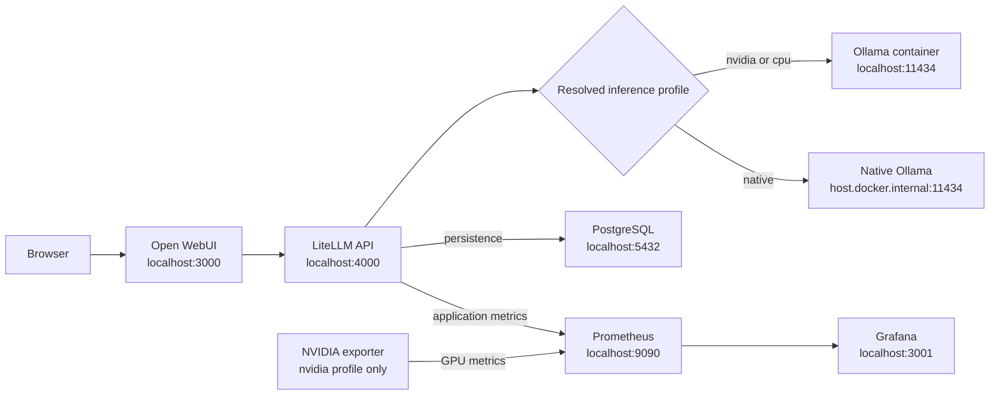

# PocketMind - Cross-platform

Local OpenAI-compatible LLM stack for Windows 11, macOS Apple Silicon, and Ubuntu/Linux.



The default text model is `corp-general` (`llama3.2:3b`). The stack also installs the multimodal model `corp-vision` (`gemma4:12b`) for complex prompts and image-to-text/OCR experiments.

## Support matrix

| Host | Architecture | Recommended profile | Acceleration | Status |
|---|---|---|---|---|
| Windows 11 + Docker Desktop/WSL2 | amd64 | `auto` or `nvidia` | NVIDIA CUDA | Runtime verified on RTX 3050 |
| macOS Sonoma 14+ | Apple Silicon arm64 | `auto` or `native` | Apple Metal via native Ollama | Static contract verified; physical Mac test required |
| Ubuntu 22.04/24.04 + Docker Compose v2 | amd64/arm64 | `auto`, `nvidia`, or `cpu` | NVIDIA or CPU | Static contract verified; physical Linux test required |
| Other current Linux distributions | amd64/arm64 | `cpu` or `native` | CPU or host runtime | Best effort |

The universal PostgreSQL, Ollama, LiteLLM, Open WebUI, Prometheus, and Grafana image digests include both `linux/amd64` and `linux/arm64`. The NVIDIA exporter is amd64-only and is used only by the NVIDIA profile.

## Profiles

| Profile | Inference runtime | GPU telemetry |
|---|---|---|
| `auto` | macOS selects native; Windows/Linux select NVIDIA after a Docker GPU probe, otherwise CPU | Matches selection |
| `nvidia` | Ollama container with NVIDIA GPU reservation | NVIDIA exporter |
| `native` | Ollama running on the host | No NVIDIA target |
| `cpu` | Portable Ollama container without GPU reservation | No NVIDIA target |

Plain `docker compose up -d` is intentionally the portable CPU-safe stack, but use it only after replacing every `CHANGE_ME` value in `.env`. The PowerShell setup path enforces this automatically.

## Common prerequisites

- Docker Desktop or Docker Engine with a current Compose v2 release that supports inline `configs.content`
- PowerShell 7 (`pwsh`) for the portable automation scripts
- At least 8 GB RAM for `corp-general`; `corp-vision` was runtime-tested on a 24 GB Windows host, where loading it caused significant memory pressure
- Several GB of free disk space for images, model files, and volumes; check the current `gemma4:12b` registry size before installation

PowerShell 7 installation: [Microsoft documentation](https://learn.microsoft.com/powershell/scripting/install/installing-powershell). The scripts also remain compatible with Windows PowerShell 5.1.

## First-time repository setup

Clone the repository, create a private local environment file, and replace every `CHANGE_ME` value before starting the stack:

```powershell
git clone https://github.com/nawariso/PocketMind.git
cd PocketMind
Copy-Item .env.example .env
notepad .env
```

On macOS or Linux, use `cp .env.example .env` and edit the file with your preferred editor. The `.env` file is intentionally excluded from Git because it contains credentials. Compose supplies the LiteLLM key to Prometheus as a runtime config without creating a tracked secret file. Docker named volumes hold runtime state and are also local to each Docker host.

## Quick start: one command

After installing the common prerequisites and creating `.env`, this single command starts the complete stack:

```powershell
pwsh ./scripts/setup.ps1 -Profile auto -Pull
```

`setup.ps1` performs the complete startup workflow:

- checks the prerequisites required by the selected profile
- resolves `auto` to `native`, `nvidia`, or `cpu` for the current host
- supplies the LiteLLM Prometheus token as a runtime Compose config
- pulls Docker images and the configured Ollama model when `-Pull` is supplied
- starts the correct Compose services and removes orphaned containers
- waits until every required container reports healthy

The script does not install Docker, PowerShell, GPU drivers, NVIDIA Container Toolkit, or native Ollama. Those host dependencies must be installed first. On macOS Apple Silicon, `auto` selects the `native` profile, so Ollama must already be installed and running; `-Pull` downloads the configured model if it is missing. On Windows and Linux, `auto` selects NVIDIA only after a successful Docker GPU probe and otherwise falls back to CPU.

On Windows PowerShell 5.1, use:

```powershell
powershell -ExecutionPolicy Bypass -File .\scripts\setup.ps1 -Profile auto -Pull
```

After setup finishes, this is the recommended end-to-end validation; it is not required to start the stack:

```powershell
pwsh ./scripts/verify-stack.ps1 -Profile auto
```

On Windows PowerShell 5.1, run the validation with:

```powershell
powershell -ExecutionPolicy Bypass -File .\scripts\verify-stack.ps1 -Profile auto
```

Automatic selection runs a bounded Docker GPU probe. Seeing `nvidia-smi` on the host alone is not considered proof that containers can use the GPU.

## Windows or Linux with NVIDIA

Windows requires Docker Desktop with the WSL2 backend. Ubuntu/Linux requires a working NVIDIA driver and NVIDIA Container Toolkit.

```powershell
pwsh ./scripts/check-prerequisites.ps1 -Profile nvidia
pwsh ./scripts/setup.ps1 -Profile nvidia -Pull
pwsh ./scripts/verify-stack.ps1 -Profile nvidia
```

The effective Compose command is:

```text
docker compose -f docker-compose.yml -f docker-compose.nvidia.yml up -d
```

The NVIDIA exporter listens on port `9835` only inside the Compose network. It is never published to the host.

## macOS Apple Silicon

Docker Desktop for macOS cannot pass the Apple GPU into an ordinary Linux container. Install Ollama natively so it can use Metal:

```powershell
ollama pull llama3.2:3b
pwsh ./scripts/setup.ps1 -Profile native
pwsh ./scripts/verify-stack.ps1 -Profile native
```

The native profile connects LiteLLM to `http://host.docker.internal:11434`. Setup checks both host access and container-to-host access. It never changes `OLLAMA_HOST` or broadens the Ollama bind address automatically. If the container check fails, review the Ollama and host firewall configuration before exposing any interface.

The compatibility form still works:

```powershell
pwsh ./scripts/setup.ps1 -NativeOllama
```

## Portable CPU mode

```powershell
pwsh ./scripts/setup.ps1 -Profile cpu -Pull
pwsh ./scripts/verify-stack.ps1 -Profile cpu
```

CPU inference is slower but requires no host GPU tooling. It is also the behavior of plain `docker compose up -d`.

## Service URLs and credentials

| Service | Address |
|---|---|
| Open WebUI | http://localhost:3000 |
| LiteLLM API | http://localhost:4000/v1 |
| LiteLLM Admin | http://localhost:4000/ui |
| Ollama container/host | http://localhost:11434 when applicable |
| Prometheus | http://localhost:9090 |
| Grafana | http://localhost:3001 |
| PostgreSQL | `127.0.0.1:5432` |

Credentials are the private values you set in `.env` after copying `.env.example`:

```text
LiteLLM admin username: admin
LiteLLM password/API master key: LITELLM_MASTER_KEY from .env
Grafana username: GRAFANA_ADMIN_USER from .env (admin in the example)
Grafana password: GRAFANA_ADMIN_PASSWORD from .env
```

The prerequisite checker refuses to start while any secret still has a `CHANGE_ME` placeholder. Never commit `.env`.

## Open WebUI login

Open `http://localhost:3000`. On a fresh volume, create the first local account and select `corp-general` for fast text work or `corp-vision` for image input. Open WebUI connects only to LiteLLM; direct Ollama access is disabled.

## Vision and OCR with Gemma 4

`corp-vision` routes to the official Ollama tag `gemma4:12b`. Gemma 4 12B is multimodal and can accept text plus images, but it is a generative vision model rather than a deterministic OCR engine. Review important transcriptions against the original image.

In Open WebUI, start a new chat, select `corp-vision`, attach an image, disable Thinking for transcription, and use a constrained prompt such as:

```text
Transcribe every visible character exactly as written. Preserve line breaks and table structure.
Do not summarize, translate, correct spelling, or invent unreadable text.
Write [ILLEGIBLE] wherever the image cannot be read confidently.
```

Thinking can consume the output-token budget before the final transcription and produce a truncated answer. For API OCR requests, send `"extra_body": {"think": false}` and allow at least 256 output tokens. Enable Thinking again for complex reasoning tasks.

Image inputs consume context tokens. The stack defaults Ollama to an 8192-token context so typical OCR images fit; if Ollama reports `request (...) exceeds the available context size`, increase `OLLAMA_CONTEXT_LENGTH` in the private `.env` and recreate the Ollama container. Larger contexts consume more RAM and KV-cache memory.

For complex text-only work, select `corp-vision` and omit the image. Keep `corp-general` for quicker responses and lower memory use.

The 12B model does not fit entirely in a 4 GB RTX 3050 Laptop GPU. Ollama will offload part of it to system RAM/CPU, so first-token latency can be high and concurrent requests are not recommended on that hardware. If the 12B model is too slow, select a smaller official Gemma 4 vision tag supported by the installed Ollama version and update both `OLLAMA_VISION_MODEL` and the physical model in `litellm/config.yaml` together.

## Test the API key

Postman configuration:

```text
POST http://localhost:4000/v1/chat/completions
Authorization: Bearer <LITELLM_MASTER_KEY from .env>
Content-Type: application/json
```

Body:

```json
{
  "model": "corp-general",
  "messages": [
    { "role": "user", "content": "Reply with exactly: API_OK" }
  ],
  "max_tokens": 16,
  "temperature": 0
}
```

Create a restricted 30-day virtual key:

```powershell
pwsh ./scripts/create-virtual-key.ps1
```

## PostgreSQL and DBeaver

```text
Host: 127.0.0.1
Port: 5432
Database: litellm
Username: litellm
Password: value of POSTGRES_PASSWORD in .env
```

Another local PostgreSQL instance, including OpenMetadata PostgreSQL, must not occupy port `5432`.

## Monitoring dashboards

Open `http://localhost:3001` and browse the `PocketMind` folder:

- `PocketMind - LiteLLM`: requests, failures, token counters, latency, and provider results
- `Local LLM - GPU & Engine`: NVIDIA hardware plus Ollama/LiteLLM engine metrics

The NVIDIA row receives data only with the `nvidia` profile. On CPU/native profiles it shows no data rather than fabricated zeros. Fan speed is `N/A` when the GPU driver does not expose it.

Ollama/LiteLLM provides running requests, token throughput, TTFT, and inter-token latency. KV-cache usage, a waiting-request gauge, and prefix-cache hit rate remain explicitly `N/A` because they are vLLM-only semantics. TTFT requires streaming requests (`"stream": true`).

Apple GPU hardware telemetry is not part of this release because Metal counters do not map directly to `nvidia-smi` metrics.

## Operations

Check status using the selected profile:

```powershell
pwsh ./scripts/verify-stack.ps1 -Profile auto
```

Run a benchmark:

```powershell
pwsh ./scripts/benchmark.ps1 -Runs 5
```

Stop the CPU/default stack:

```text
docker compose down
```

Stop the NVIDIA stack:

```text
docker compose -f docker-compose.yml -f docker-compose.nvidia.yml down
```

Stop the native stack:

```text
docker compose -f docker-compose.native-ollama.yml down
```

Do not add `-v` unless you intentionally want to delete PostgreSQL, Grafana, Prometheus, Open WebUI, and container Ollama volumes.

## Temporary public test with Cloudflare Quick Tunnel

Use a [Cloudflare Quick Tunnel](https://developers.cloudflare.com/cloudflare-one/networks/connectors/cloudflare-tunnel/do-more-with-tunnels/trycloudflare/) to test Open WebUI from another network without buying a public IP, forwarding router ports, or changing PocketMind's localhost-only port bindings. Quick Tunnels are temporary, have no uptime guarantee, and are not suitable for production.

Before starting, verify that Open WebUI is healthy with the same Compose file arguments used to start the active profile. For example, for the NVIDIA profile:

```text
docker compose -f docker-compose.yml -f docker-compose.nvidia.yml ps open-webui
curl http://127.0.0.1:3000/api/config
```

For the CPU profile use plain `docker compose ps open-webui`; for native Ollama use `docker compose -f docker-compose.native-ollama.yml ps open-webui`. The returned configuration should show authentication enabled and signup disabled. Then start a tunnel on Windows or macOS with Docker Desktop:

```text
docker pull cloudflare/cloudflared:latest
docker run --detach \
  --name pocketmind-cloudflared-quick \
  --restart no \
  cloudflare/cloudflared:latest \
  tunnel --no-autoupdate --url http://host.docker.internal:3000
```

On Linux, add Docker's host-gateway mapping:

```text
docker run --detach \
  --name pocketmind-cloudflared-quick \
  --restart no \
  --add-host host.docker.internal:host-gateway \
  cloudflare/cloudflared:latest \
  tunnel --no-autoupdate --url http://host.docker.internal:3000
```

Read the generated public HTTPS URL from the logs:

```text
docker logs pocketmind-cloudflared-quick
```

Look for a URL ending in `.trycloudflare.com`, open it from a device on another network, sign in with an existing Open WebUI account, select `corp-general`, and send a test message. Do not publish the temporary URL or any credentials in the repository.

Only Open WebUI port `3000` is proxied by this command. Do not create public tunnels to LiteLLM, PostgreSQL, Ollama, Prometheus, Grafana, or the NVIDIA exporter. In particular, never expose or distribute `LITELLM_MASTER_KEY` as a client API key.

Manage the test tunnel with:

```text
# Show status and logs
docker ps --filter name=pocketmind-cloudflared-quick
docker logs pocketmind-cloudflared-quick

# Stop or resume the existing container
docker stop pocketmind-cloudflared-quick
docker start pocketmind-cloudflared-quick

# Remove it when testing is finished
docker rm -f pocketmind-cloudflared-quick
```

The `--restart no` policy prevents this temporary public endpoint from silently returning after a Docker or host restart. Restarting the tunnel process can produce a different public URL. If the container name already exists and you intentionally want a fresh tunnel, remove the old container before running `docker run` again. For a stable hostname and access policies, replace Quick Tunnel with a named Cloudflare Tunnel tied to a domain managed in Cloudflare.

## State portability

Configuration is portable; runtime state is host-local:

- named Docker volumes remain on the Docker host where they were created
- native Ollama models remain in that host's Ollama model directory
- a new machine pulls images/models and creates fresh volumes
- migrate PostgreSQL with `pg_dump`/restore, not by copying raw volume directories across operating systems

## Troubleshooting

```powershell
pwsh ./scripts/check-prerequisites.ps1 -Profile auto
docker compose ps
docker compose logs litellm
docker compose logs open-webui
docker compose logs prometheus
```

NVIDIA only:

```powershell
docker compose -f docker-compose.yml -f docker-compose.nvidia.yml logs nvidia-exporter
nvidia-smi
```

Native Ollama:

```powershell
ollama list
ollama ps
```

All published Compose ports bind to `127.0.0.1` only. Do not expose this POC directly to the Internet; it intentionally omits TLS, SSO, network segmentation, HA, and enterprise secret management.

## Validation scope

The repository contains static contracts for Windows, macOS, Linux, amd64, arm64, all Compose profiles, dashboards, and script portability. A platform is described as runtime-verified only after the full verifier runs on physical hardware or an appropriate self-hosted runner. CI configuration rendering does not certify GPU acceleration.

Run the network-dependent multi-architecture image check before changing pinned image digests:

```powershell
pwsh ./tests/image-manifest.ps1
```
