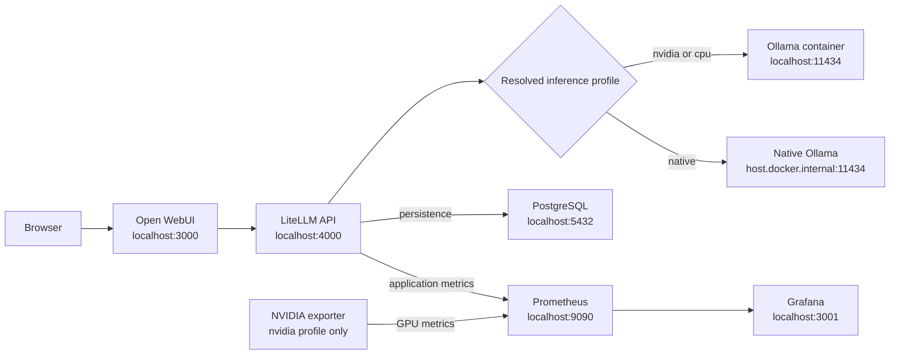

# PocketMind - Cross-platform

Local OpenAI-compatible LLM stack for Windows 11, macOS Apple Silicon, and Ubuntu/Linux.



The default text model is `corp-general` (`qwen3:4b-instruct-2507-q4_K_M`). It is a text-only Qwen 3 4B Instruct Q4 model selected for stronger Thai, reasoning, coding, and tool calling than the previous Llama 3.2 3B while remaining practical on a 4 GB laptop GPU through partial CPU/RAM offload. The stack also installs `corp-ocr` (`scb10x/typhoon-ocr1.5-3b`), the Typhoon-recommended Ollama build for Thai and English document OCR.

## Support matrix

| Host | Architecture | Recommended profile | Acceleration | Status |
|---|---|---|---|---|
| Windows 11 + Docker Desktop/WSL2 | amd64 | `auto` or `nvidia` | NVIDIA CUDA | Runtime verified on RTX 3050 |
| macOS Sonoma 14+ | Apple Silicon arm64 | `auto` or `native` | Apple Metal via native Ollama | Static contract verified; physical Mac test required |
| Ubuntu 22.04/24.04 + Docker Compose v2 | amd64/arm64 | `auto`, `nvidia`, or `cpu` | NVIDIA or CPU | Static contract verified; physical Linux test required |
| Other current Linux distributions | amd64/arm64 | `cpu` or `native` | CPU or host runtime | Best effort |

The universal PostgreSQL, Ollama, LiteLLM, Open WebUI, Prometheus, and Grafana image digests include both `linux/amd64` and `linux/arm64`. The NVIDIA exporter is amd64-only and is used only by the NVIDIA profile.

## Profiles

| Profile | Inference runtime | GPU telemetry |
|---|---|---|
| `auto` | macOS selects native; Windows/Linux select NVIDIA after a Docker GPU probe, otherwise CPU | Matches selection |
| `nvidia` | Ollama container with NVIDIA GPU reservation | NVIDIA exporter |
| `native` | Ollama running on the host | No NVIDIA target |
| `cpu` | Portable Ollama container without GPU reservation | No NVIDIA target |

Plain `docker compose up -d` is intentionally the portable CPU-safe stack, but use it only after replacing every `CHANGE_ME` value in `.env`. The PowerShell setup path enforces this automatically.

## Common prerequisites

- Docker Desktop or Docker Engine with a current Compose v2 release that supports inline `configs.content`
- PowerShell 7 (`pwsh`) for the portable automation scripts
- At least 8 GB RAM; 16 GB or more is recommended when Docker Desktop and OCR run together
- Several GB of free disk space for images, model files, and volumes; the Typhoon Ollama model currently downloads about 3.2 GB

PowerShell 7 installation: [Microsoft documentation](https://learn.microsoft.com/powershell/scripting/install/installing-powershell). The scripts also remain compatible with Windows PowerShell 5.1.

## First-time repository setup

Clone the repository, create a private local environment file, and replace every `CHANGE_ME` value before starting the stack:

```powershell
git clone https://github.com/nawariso/PocketMind.git
cd PocketMind
Copy-Item .env.example .env
notepad .env
```

On macOS or Linux, use `cp .env.example .env` and edit the file with your preferred editor. The `.env` file is intentionally excluded from Git because it contains credentials. Compose supplies the LiteLLM key to Prometheus as a runtime config without creating a tracked secret file. Docker named volumes hold runtime state and are also local to each Docker host.

## Quick start: one command

After installing the common prerequisites and creating `.env`, this single command starts the complete stack:

```powershell
pwsh ./scripts/setup.ps1 -Profile auto -Pull
```

`setup.ps1` performs the complete startup workflow:

- checks the prerequisites required by the selected profile
- resolves `auto` to `native`, `nvidia`, or `cpu` for the current host
- supplies the LiteLLM Prometheus token as a runtime Compose config
- pulls Docker images and the configured Ollama model when `-Pull` is supplied
- starts the correct Compose services and removes orphaned containers
- waits until every required container reports healthy

The script does not install Docker, PowerShell, GPU drivers, NVIDIA Container Toolkit, or native Ollama. Those host dependencies must be installed first. On macOS Apple Silicon, `auto` selects the `native` profile, so Ollama must already be installed and running; `-Pull` downloads the configured model if it is missing. On Windows and Linux, `auto` selects NVIDIA only after a successful Docker GPU probe and otherwise falls back to CPU.

## Model Lab: try another Ollama model without editing config

Model Lab downloads an exact Ollama model tag and registers a separate `lab-*` alias through LiteLLM's database-backed model-management API. Production aliases in `litellm/config.yaml` remain unchanged, aliases persist across LiteLLM restarts, and adding or removing an alias does not require a LiteLLM restart.

### Model Lab prerequisites

Before using Model Lab:

- Complete the normal PocketMind setup and keep Ollama, LiteLLM, and PostgreSQL running.
- Configure the private `.env`; the script reads the LiteLLM master key locally and never accepts it as a command-line argument.
- Verify the exact tag on the Ollama registry page. Check download size, quantization, context, modalities, tool support, and license.
- Check available disk, RAM, and VRAM. A successful download proves availability, not acceptable speed or memory fit.
- Use `-Profile auto` unless you intentionally run `cpu`, `native`, or `nvidia`. The profile controls whether the script calls native Ollama or the Ollama container.

### Model Lab command reference

| Action | Required input | Important options | Behavior |
|---|---|---|---|
| `add` | `-Model <exact-tag>` | `-Alias lab-*`, `-Profile auto` | Pulls and inspects the model, creates a persistent LiteLLM alias, and verifies discovery. |
| `list` | none | `-Profile auto` | Lists Model Lab aliases, physical models, and deployment IDs. |
| `test` | `-Alias lab-*` | `-Prompt`, `-MaxTokens` | Sends one deterministic text chat request and reports latency and output tokens. `-MaxTokens` defaults to `128` and accepts `8`–`2048`. |
| `remove` | `-Alias lab-*` | `-DeleteWeights` | Removes the LiteLLM alias; weights are retained unless explicitly requested. |

`-Alias` is optional for `add`; if omitted, the script derives a lowercase `lab-*` alias from the physical model name. Supplying an explicit short alias is recommended because it is easier to recognize in Open WebUI and test output. Aliases may contain lowercase letters, numbers, dot, underscore, and dash.

Add and download a model:

```powershell
pwsh ./scripts/model-lab.ps1 add -Model qwen3:8b -Alias lab-qwen3-8b -Profile auto
```

List registered lab aliases:

```powershell
pwsh ./scripts/model-lab.ps1 list -Profile auto
```

Run a timed text test with a larger output budget:

```powershell
pwsh ./scripts/model-lab.ps1 test -Alias lab-qwen3-8b `
  -Prompt 'อธิบายข้อดีข้อเสียของ local AI แบบสั้น ๆ' `
  -MaxTokens 256 `
  -Profile auto
```

The reported wall-clock rate includes request overhead and may include model load or warm-up time. Run the same test at least twice: treat the first run as cold-start behavior and later runs as warm behavior. Compare answer quality as well as latency.

The built-in `test` action exercises text chat only. It does not prove image input, OCR accuracy, thinking behavior, structured output, or tool calling. Test those capabilities separately with a known fixture and the model's declared capabilities before relying on them.

Remove only the LiteLLM alias and retain downloaded Ollama weights:

```powershell
pwsh ./scripts/model-lab.ps1 remove -Alias lab-qwen3-8b -Profile auto
```

Remove both the alias and downloaded weights:

```powershell
pwsh ./scripts/model-lab.ps1 remove -Alias lab-qwen3-8b -DeleteWeights -Profile auto
```

Without `-DeleteWeights`, adding the same physical model again can reuse the local weights. With `-DeleteWeights`, the script refuses to remove a production model or weights still referenced by another lab alias.

Windows PowerShell 5.1 uses the same actions with the compatibility invocation form:

```powershell
powershell -ExecutionPolicy Bypass -File .\scripts\model-lab.ps1 add -Model qwen3:8b -Alias lab-qwen3-8b -Profile auto
powershell -ExecutionPolicy Bypass -File .\scripts\model-lab.ps1 test -Alias lab-qwen3-8b -MaxTokens 256 -Profile auto
powershell -ExecutionPolicy Bypass -File .\scripts\model-lab.ps1 remove -Alias lab-qwen3-8b -Profile auto
```

### Recommended Model Lab workflow

1. Verify the exact Ollama tag and estimate whether its quantized weights plus an 8192-token context fit this machine.
2. Run `add` with a unique `lab-*` alias. Never reuse `corp-general` or `corp-ocr` for an experiment.
3. Run `list` to confirm the alias-to-physical-model mapping.
4. Run the same `test` prompt at least twice and record cold and warm latency.
5. Test the actual workload separately: Thai, reasoning, coding, tools, vision, or OCR as applicable.
6. Inspect placement with `docker exec pocketmind-ollama ollama ps` for container profiles or `ollama ps` for the native profile. Avoid concurrent large-model requests on memory-constrained hardware.
7. If the model is not useful, run `remove`; add `-DeleteWeights` only when no other lab alias needs the same weights.
8. If the model should replace a production alias, update the version-controlled config and normal contracts in a separate reviewed change. Model Lab does not promote a model automatically.

### Open WebUI access

The local CLI can test a lab alias immediately. Open WebUI administrators also see the alias after refreshing the browser. Regular Open WebUI users do not receive access automatically: an administrator must create a Workspace Model that uses the `lab-*` alias as its base model, then grant the intended users or `user:*` read access. This separation prevents newly downloaded experimental models from becoming available to every tester without review.

### Model Lab troubleshooting

- **Alias already exists:** run `list`, choose another `lab-*` alias, or remove the old alias first.
- **Alias is absent in Open WebUI:** hard-refresh or sign out/in. Admins should see the base alias; regular users need a Workspace Model and explicit read grant.
- **Download succeeds but inference is slow:** inspect `ollama ps` placement, shorten context/history, close other GPU workloads, and compare warm runs. Models larger than VRAM will offload to CPU/RAM.
- **Test times out:** each Model Lab text test has a 300-second request timeout. A timeout usually means the model is too slow, still loading, or under memory pressure; inspect `ollama ps` and runtime logs before retrying.
- **Out of memory or context errors:** stop other model requests, start a new chat, reduce prompt/history, or remove the candidate. Do not raise context blindly because KV-cache memory also grows.
- **Tool or image errors:** confirm the model advertises the capability. Do not send tools to a completion/vision-only model, and do not assume a text model accepts images.
- **Remove keeps disk usage:** this is expected without `-DeleteWeights`; run the explicit deletion form only after confirming the physical model is not shared.
- **Partial add failure:** the script attempts to roll back the database deployment. Run `list` afterward and remove any remaining `lab-*` alias before retrying.

The namespace and deletion guards are protections implemented by `model-lab.ps1`, not server-side LiteLLM authorization rules. Treat the LiteLLM master key as an administrator credential: anyone holding it can call model-management endpoints directly and bypass the script. Never expose that key through Open WebUI, a public tunnel, Postman collections, logs, or source control.

For the normal stack setup on Windows PowerShell 5.1, use:

```powershell
powershell -ExecutionPolicy Bypass -File .\scripts\setup.ps1 -Profile auto -Pull
```

After setup finishes, this is the recommended end-to-end validation; it is not required to start the stack:

```powershell
pwsh ./scripts/verify-stack.ps1 -Profile auto
```

On Windows PowerShell 5.1, run the validation with:

```powershell
powershell -ExecutionPolicy Bypass -File .\scripts\verify-stack.ps1 -Profile auto
```

Automatic selection runs a bounded Docker GPU probe. Seeing `nvidia-smi` on the host alone is not considered proof that containers can use the GPU.

## Windows or Linux with NVIDIA

Windows requires Docker Desktop with the WSL2 backend. Ubuntu/Linux requires a working NVIDIA driver and NVIDIA Container Toolkit.

```powershell
pwsh ./scripts/check-prerequisites.ps1 -Profile nvidia
pwsh ./scripts/setup.ps1 -Profile nvidia -Pull
pwsh ./scripts/verify-stack.ps1 -Profile nvidia
```

The effective Compose command is:

```text
docker compose -f docker-compose.yml -f docker-compose.nvidia.yml up -d
```

The NVIDIA exporter listens on port `9835` only inside the Compose network. It is never published to the host.

## macOS Apple Silicon

Docker Desktop for macOS cannot pass the Apple GPU into an ordinary Linux container. Install Ollama natively so it can use Metal:

```powershell
ollama pull qwen3:4b-instruct-2507-q4_K_M
pwsh ./scripts/setup.ps1 -Profile native
pwsh ./scripts/verify-stack.ps1 -Profile native
```

The native profile connects LiteLLM to `http://host.docker.internal:11434`. Setup checks both host access and container-to-host access. It never changes `OLLAMA_HOST` or broadens the Ollama bind address automatically. If the container check fails, review the Ollama and host firewall configuration before exposing any interface.

The compatibility form still works:

```powershell
pwsh ./scripts/setup.ps1 -NativeOllama
```

## Portable CPU mode

```powershell
pwsh ./scripts/setup.ps1 -Profile cpu -Pull
pwsh ./scripts/verify-stack.ps1 -Profile cpu
```

CPU inference is slower but requires no host GPU tooling. It is also the behavior of plain `docker compose up -d`.

## Service URLs and credentials

| Service | Address |
|---|---|
| Open WebUI | http://localhost:3000 |
| LiteLLM API | http://localhost:4000/v1 |
| LiteLLM Admin | http://localhost:4000/ui |
| Ollama container/host | http://localhost:11434 when applicable |
| Prometheus | http://localhost:9090 |
| Grafana | http://localhost:3001 |
| PostgreSQL | `127.0.0.1:5432` |

Credentials are the private values you set in `.env` after copying `.env.example`:

```text
LiteLLM admin username: admin
LiteLLM password/API master key: LITELLM_MASTER_KEY from .env
Grafana username: GRAFANA_ADMIN_USER from .env (admin in the example)
Grafana password: GRAFANA_ADMIN_PASSWORD from .env
```

The prerequisite checker refuses to start while any secret still has a `CHANGE_ME` placeholder. Never commit `.env`.

## Open WebUI login

Open `http://localhost:3000`. On a fresh volume, create the first local account and select `corp-general` for general text work or `corp-ocr` for document images. Open WebUI connects only to LiteLLM; direct Ollama access is disabled.

## Thai and English OCR with Typhoon

`corp-ocr` routes to `scb10x/typhoon-ocr1.5-3b`, the on-device Ollama build recommended by the Typhoon OCR 1.5 authors. The exact Hugging Face checkpoint `typhoon-ai/typhoon-ocr1.5-2b` uses Qwen3-VL 2B; the recommended Ollama build uses a quantized Qwen2.5-VL 3B model. This distinction is intentional because the authors warn that third-party GGUF conversions may reduce OCR accuracy.

This is a task-specific OCR model, not a general chat or VQA model. Its Ollama build supports completion and vision but not tool calling. In Open WebUI, keep `Built-in Tools: Off` for `corp-ocr`; otherwise Open WebUI can attach a `tools` payload and Ollama will reject the request. Start a new chat, select `corp-ocr`, attach one document image, set temperature to `0.1`, and use the model's required prompt:

```text
Extract all text from the image.

Instructions:
- Only return the clean Markdown.
- Do not include any explanation or extra text.
- You must include all information on the page.

Formatting Rules:
- Tables: Render tables using <table>...</table> in clean HTML format.
- Equations: Render equations using LaTeX syntax with inline ($...$) and block ($$...$$).
- Page Numbers: Wrap page numbers in <page_number>...</page_number>.
- Checkboxes: Use ☐ for unchecked and ☑ for checked boxes.
```

Use `corp-general` for complex reasoning or ordinary chat. Typhoon OCR can still hallucinate, so compare important output with the source document. Image inputs consume context tokens; if Ollama reports `exceeds the available context size`, increase `OLLAMA_CONTEXT_LENGTH` in the private `.env` and recreate the Ollama container. Larger contexts consume more RAM and KV-cache memory.

## Test the API key

Postman configuration:

```text
POST http://localhost:4000/v1/chat/completions
Authorization: Bearer <LITELLM_MASTER_KEY from .env>
Content-Type: application/json
```

Body:

```json
{
  "model": "corp-general",
  "messages": [
    { "role": "user", "content": "Reply with exactly: API_OK" }
  ],
  "max_tokens": 16,
  "temperature": 0
}
```

Create a restricted 30-day virtual key:

```powershell
pwsh ./scripts/create-virtual-key.ps1
```

## PostgreSQL and DBeaver

```text
Host: 127.0.0.1
Port: 5432
Database: litellm
Username: litellm
Password: value of POSTGRES_PASSWORD in .env
```

Another local PostgreSQL instance, including OpenMetadata PostgreSQL, must not occupy port `5432`.

## Monitoring dashboards

Open `http://localhost:3001` and browse the `PocketMind` folder:

- `PocketMind - LiteLLM`: requests, failures, token counters, latency, and provider results
- `Local LLM - GPU & Engine`: NVIDIA hardware plus Ollama/LiteLLM engine metrics

The NVIDIA row receives data only with the `nvidia` profile. On CPU/native profiles it shows no data rather than fabricated zeros. Fan speed is `N/A` when the GPU driver does not expose it.

Ollama/LiteLLM provides running requests, token throughput, TTFT, and inter-token latency. KV-cache usage, a waiting-request gauge, and prefix-cache hit rate remain explicitly `N/A` because they are vLLM-only semantics. TTFT requires streaming requests (`"stream": true`).

Apple GPU hardware telemetry is not part of this release because Metal counters do not map directly to `nvidia-smi` metrics.

## Operations

Check status using the selected profile:

```powershell
pwsh ./scripts/verify-stack.ps1 -Profile auto
```

Run a benchmark:

```powershell
pwsh ./scripts/benchmark.ps1 -Runs 5
```

Stop the CPU/default stack:

```text
docker compose down
```

Stop the NVIDIA stack:

```text
docker compose -f docker-compose.yml -f docker-compose.nvidia.yml down
```

Stop the native stack:

```text
docker compose -f docker-compose.native-ollama.yml down
```

Do not add `-v` unless you intentionally want to delete PostgreSQL, Grafana, Prometheus, Open WebUI, and container Ollama volumes.

## Temporary public test with Cloudflare Quick Tunnel

Use a [Cloudflare Quick Tunnel](https://developers.cloudflare.com/cloudflare-one/networks/connectors/cloudflare-tunnel/do-more-with-tunnels/trycloudflare/) to test Open WebUI from another network without buying a public IP, forwarding router ports, or changing PocketMind's localhost-only port bindings. Quick Tunnels are temporary, have no uptime guarantee, and are not suitable for production.

Before starting, verify that Open WebUI is healthy with the same Compose file arguments used to start the active profile. For example, for the NVIDIA profile:

```text
docker compose -f docker-compose.yml -f docker-compose.nvidia.yml ps open-webui
curl http://127.0.0.1:3000/api/config
```

For the CPU profile use plain `docker compose ps open-webui`; for native Ollama use `docker compose -f docker-compose.native-ollama.yml ps open-webui`. The returned configuration should show authentication enabled and signup disabled. Then start a tunnel on Windows or macOS with Docker Desktop:

```text
docker pull cloudflare/cloudflared:latest
docker run --detach \
  --name pocketmind-cloudflared-quick \
  --restart no \
  cloudflare/cloudflared:latest \
  tunnel --no-autoupdate --url http://host.docker.internal:3000
```

On Linux, add Docker's host-gateway mapping:

```text
docker run --detach \
  --name pocketmind-cloudflared-quick \
  --restart no \
  --add-host host.docker.internal:host-gateway \
  cloudflare/cloudflared:latest \
  tunnel --no-autoupdate --url http://host.docker.internal:3000
```

Read the generated public HTTPS URL from the logs:

```text
docker logs pocketmind-cloudflared-quick
```

Look for a URL ending in `.trycloudflare.com`, open it from a device on another network, sign in with an existing Open WebUI account, select `corp-general`, and send a test message. Do not publish the temporary URL or any credentials in the repository.

Only Open WebUI port `3000` is proxied by this command. Do not create public tunnels to LiteLLM, PostgreSQL, Ollama, Prometheus, Grafana, or the NVIDIA exporter. In particular, never expose or distribute `LITELLM_MASTER_KEY` as a client API key.

Manage the test tunnel with:

```text
# Show status and logs
docker ps --filter name=pocketmind-cloudflared-quick
docker logs pocketmind-cloudflared-quick

# Stop or resume the existing container
docker stop pocketmind-cloudflared-quick
docker start pocketmind-cloudflared-quick

# Remove it when testing is finished
docker rm -f pocketmind-cloudflared-quick
```

The `--restart no` policy prevents this temporary public endpoint from silently returning after a Docker or host restart. Restarting the tunnel process can produce a different public URL. If the container name already exists and you intentionally want a fresh tunnel, remove the old container before running `docker run` again. For a stable hostname and access policies, replace Quick Tunnel with a named Cloudflare Tunnel tied to a domain managed in Cloudflare.

## State portability

Configuration is portable; runtime state is host-local:

- named Docker volumes remain on the Docker host where they were created
- native Ollama models remain in that host's Ollama model directory
- a new machine pulls images/models and creates fresh volumes
- migrate PostgreSQL with `pg_dump`/restore, not by copying raw volume directories across operating systems

## Troubleshooting

```powershell
pwsh ./scripts/check-prerequisites.ps1 -Profile auto
docker compose ps
docker compose logs litellm
docker compose logs open-webui
docker compose logs prometheus
```

NVIDIA only:

```powershell
docker compose -f docker-compose.yml -f docker-compose.nvidia.yml logs nvidia-exporter
nvidia-smi
```

Native Ollama:

```powershell
ollama list
ollama ps
```

All published Compose ports bind to `127.0.0.1` only. Do not expose this POC directly to the Internet; it intentionally omits TLS, SSO, network segmentation, HA, and enterprise secret management.

## Validation scope

The repository contains static contracts for Windows, macOS, Linux, amd64, arm64, all Compose profiles, dashboards, and script portability. A platform is described as runtime-verified only after the full verifier runs on physical hardware or an appropriate self-hosted runner. CI configuration rendering does not certify GPU acceleration.

Run the network-dependent multi-architecture image check before changing pinned image digests:

```powershell
pwsh ./tests/image-manifest.ps1
```
