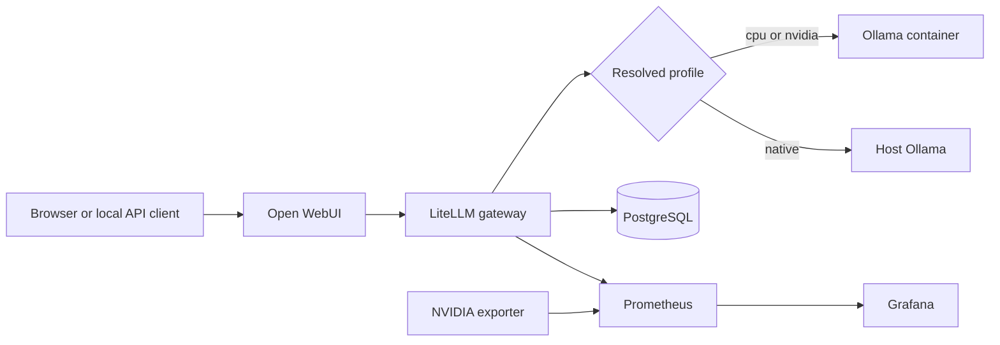

# PocketMind Architecture

## Purpose

PocketMind is a single-host, local OpenAI-compatible LLM stack. The default security boundary is the host: published service ports bind to `127.0.0.1`, while containers communicate on the private Compose network `ai-net`.

## Request path

Open WebUI has direct Ollama access disabled. It uses LiteLLM as its OpenAI-compatible backend. LiteLLM owns stable routing aliases and sends requests to Ollama.

## Stable and experimental aliases

Version-controlled aliases in `litellm/config.yaml` are production contracts:

- `corp-general` → `qwen3:4b-instruct-2507-q4_K_M`
- `corp-ocr` → `scb10x/typhoon-ocr1.5-3b`

Model Lab creates `lab-*` aliases through LiteLLM's model-management API. Those aliases are stored in PostgreSQL and persist across LiteLLM restarts, but they do not modify production config. Promotion from `lab-*` to a production alias is a separate reviewed config change.

## Profiles

| Profile | Ollama location | Acceleration | Additional services |
|---|---|---|---|
| `cpu` | Container | CPU | None |
| `nvidia` | Container | NVIDIA GPU reservation | NVIDIA exporter and GPU Prometheus target |
| `native` | Host via `host.docker.internal:11434` | Host runtime, including Metal on Apple Silicon | No container Ollama/exporter |
| `auto` | Resolved by setup | NVIDIA when bounded probe succeeds; native on macOS; otherwise CPU | Matches resolved profile |

The container Ollama runtime limits loaded models and parallel inference to one each. This protects memory-constrained hardware and means concurrent heavy requests should not be expected to scale.

## Persistence boundaries

| State | Storage | Rebuildability |
|---|---|---|
| LiteLLM database models, keys, spend data | Compose logical volume `postgres_data` (normally `pocketmind_postgres_data`; project prefix may vary) | Back up with PostgreSQL tools |
| Open WebUI users, chats, workspace models/grants | Compose logical volume `openwebui_data` (normally `pocketmind_openwebui_data`; project prefix may vary) | Back up the volume/data directory |
| Ollama weights | Compose logical volume `ollama_data` (normally `pocketmind_ollama_data`) or host Ollama directory | Re-pullable; large but not unique |
| Prometheus time series | Compose logical volume `prometheus_data` | Disposable unless history matters |
| Grafana local state | Compose logical volume `grafana_data` | Dashboards/datasource are provisioned from Git; local changes need backup |
| Production config and scripts | Git | Clone/checkout |
| Secrets | private `.env` | Must be preserved separately; never commit |

## Trust boundaries

- Open WebUI authenticates human users and applies workspace model grants.
- LiteLLM master-key access is administrative; it can manage models and bypass Model Lab's client-side namespace guard.
- `corp-ocr` is an OCR-only model. Open WebUI metadata must retain `vision=true` and `builtin_tools=false` because the Typhoon Ollama build does not support tools.
- Model Lab aliases are admin-visible in Open WebUI; ordinary users require a Workspace Model and explicit read grant.
- Quick Tunnel is a temporary exception to localhost-only access and should expose only Open WebUI unless a separate, explicitly controlled API test is required.

## Monitoring

LiteLLM exports request/token/latency metrics to Prometheus. The NVIDIA profile additionally scrapes the GPU exporter. Grafana provisions the PocketMind LiteLLM and GPU/engine dashboards from version-controlled files.

## Failure domains

- Ollama failure stops inference but should not corrupt user/database state.
- LiteLLM failure stops routing and Model Lab management; PostgreSQL persists DB-backed state.
- PostgreSQL failure affects LiteLLM readiness and dynamic model/key state.
- Open WebUI failure affects browser access but not direct local LiteLLM API testing.
- Monitoring failure does not stop inference but removes operational visibility.
