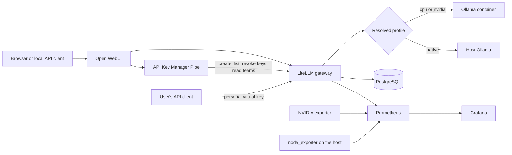

# PocketMind Architecture

## Purpose

PocketMind is a single-host, local OpenAI-compatible LLM stack. The default security boundary is the host: published service ports bind to `127.0.0.1`, while containers communicate on the private Compose network `ai-net`.

## Request path

```mermaid
flowchart LR
    Client[Browser or local API client] --> WebUI[Open WebUI]
    WebUI --> LiteLLM[LiteLLM gateway]
    LiteLLM --> Runtime{Resolved profile}
    Runtime -->|cpu or nvidia| OllamaContainer[Ollama container]
    Runtime -->|native| OllamaHost[Host Ollama]
    LiteLLM --> PostgreSQL[(PostgreSQL)]
    LiteLLM --> Prometheus[Prometheus]
    NvidiaExporter[NVIDIA exporter] --> Prometheus
    NodeExporter[node_exporter on the host] --> Prometheus
    Prometheus --> Grafana[Grafana]
    WebUI --> KeyManager[API Key Manager Pipe]
    KeyManager -->|create, list, revoke keys; read teams| LiteLLM
    ApiClient[User's API client] -->|personal virtual key| LiteLLM
```

The NVIDIA exporter exists only in the `nvidia` profile and `node_exporter` only in the `native` profile. The API Key Manager runs inside Open WebUI; users call LiteLLM directly with the key it issues.

Open WebUI has direct Ollama access disabled. It uses LiteLLM as its OpenAI-compatible backend. LiteLLM owns stable routing aliases and sends requests to Ollama.

## Stable and experimental aliases

Version-controlled aliases in `litellm/config.yaml` are production contracts:

- `corp-general` → `qwen3:4b-instruct-2507-q4_K_M`
- `corp-ocr` → `scb10x/typhoon-ocr1.5-3b`

Model Lab creates `lab-*` aliases through LiteLLM's model-management API. Those aliases are stored in PostgreSQL and persist across LiteLLM restarts, but they do not modify production config. Promotion from `lab-*` to a production alias is a separate reviewed config change.

## Profiles

| Profile | Ollama location | Acceleration | Additional services |
|---|---|---|---|
| `cpu` | Container | CPU | None |
| `nvidia` | Container | NVIDIA GPU reservation | NVIDIA exporter and GPU Prometheus target |
| `native` | Host via `host.docker.internal:11434` | Host runtime, including Metal on Apple Silicon | No container Ollama/exporter |
| `auto` | Resolved by setup | NVIDIA when bounded probe succeeds; native on macOS; otherwise CPU | Matches resolved profile |

The container Ollama runtime limits loaded models and parallel inference to one each. This protects memory-constrained hardware and means concurrent heavy requests should not be expected to scale.

## Persistence boundaries

| State | Storage | Rebuildability |
|---|---|---|
| LiteLLM database models, keys, teams, spend data | Compose logical volume `postgres_data` (normally `pocketmind_postgres_data`; project prefix may vary) | Back up with PostgreSQL tools |
| Open WebUI users, chats, workspace models/grants, persisted settings (connection key, default role, task model), the API Key Manager function and its Valves, groups | Compose logical volume `openwebui_data` (normally `pocketmind_openwebui_data`; project prefix may vary) | Back up the volume/data directory |
| Ollama weights | Compose logical volume `ollama_data` (normally `pocketmind_ollama_data`) or host Ollama directory | Re-pullable; large but not unique |
| Prometheus time series | Compose logical volume `prometheus_data` | Disposable unless history matters |
| Grafana local state | Compose logical volume `grafana_data` | Dashboards/datasource are provisioned from Git; local changes need backup |
| Production config and scripts | Git | Clone/checkout |
| Secrets | private `.env` | Must be preserved separately; never commit |

## Trust boundaries

- Open WebUI authenticates human users and applies workspace model grants.
- LiteLLM master-key access is administrative; it can manage models and bypass Model Lab's client-side namespace guard.
- `corp-ocr` is an OCR-only model. Open WebUI metadata must retain `vision=true` and `builtin_tools=false` because the Typhoon Ollama build does not support tools.
- Model Lab aliases are admin-visible in Open WebUI; ordinary users require a Workspace Model and explicit read grant.
- The API Key Manager Pipe runs server-side in Open WebUI and reads the LiteLLM master key from the container environment to create keys. Only administrators can install or edit it. It takes the user's identity from Open WebUI's `__user__` value, ignores calls made for titles/tags/follow-ups, and can touch only keys whose `user_id` is the caller's.
- Issued keys are LiteLLM virtual keys limited to one model each, with a mandatory expiry and rate/concurrency limits. They call LiteLLM directly, so any network exposure of LiteLLM must forward only `/v1/*`.
- LiteLLM teams are the single place where teams are managed. A user's team is found by matching the account email against team members; teams are mirrored one way to Open WebUI groups. Deleting a team deletes its keys.
- Quick Tunnel is a temporary exception to localhost-only access and should expose only Open WebUI unless a separate, explicitly controlled API test is required.

## Monitoring

LiteLLM exports request/token/latency metrics to Prometheus. The NVIDIA profile additionally scrapes the GPU exporter, and the native profile scrapes `node_exporter` on the host (`prometheus/prometheus.native.yml`, target `host.docker.internal:9100`). Grafana provisions three dashboards from version-controlled files: `PocketMind - LiteLLM`, `Local LLM - GPU & Engine` (NVIDIA hardware plus engine charts), and `Local LLM - Host (macOS & CPU)` (CPU, unified memory, swap, load, and the same engine charts). Each dashboard shows no data on profiles that lack its source; panels for values that cannot be measured truthfully (KV cache, prefix cache, and on macOS power and temperature) are omitted or marked N/A, never estimated.

LiteLLM records tokens per request, key, user, and team. Local models have no price, so cost views are zero; `scripts/usage-report.ps1` compares measured tokens with commercial prices instead.

## Failure domains

- Ollama failure stops inference but should not corrupt user/database state.
- LiteLLM failure stops routing and Model Lab management; PostgreSQL persists DB-backed state.
- PostgreSQL failure affects LiteLLM readiness and dynamic model/key state.
- Open WebUI failure affects browser access but not direct local LiteLLM API testing.
- Monitoring failure does not stop inference but removes operational visibility.
